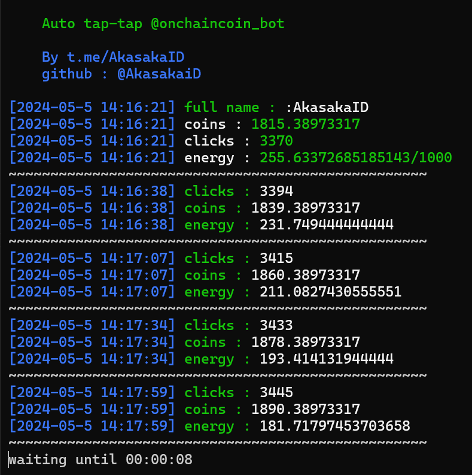

# Onchaincoin_bot

Auto tap-tap for onchaincoin_bot telegram.

<center>

</center>

## [English README](readme.md)

## Start the bot

[https://t.me/onchaincoin_bot?start=user_629438076](https://t.me/onchaincoin_bot?start=user_629438076)

## Cara mendapatkan data

Buat cara dapetin data akun, lihat tutorial video dibawah
[https://youtu.be/VlUxMQ3xLQM](https://youtu.be/VlUxMQ3xLQM)

## Instalasi

1. Pastikan komputer Anda sudah terinstal python dan git. Jika belum, cari di google bagaimana cara menginstalnya.
2. Kloning repositori ini
   ```
   git clone https://github.com/akasakaid/onchenbot.git
   ```
3. Pindah ke direktori onchenbot
   ```
   cd onchenbot
   ```
4. Instal pustaka / modul.
   ```
   pip install -r requirements.txt
   ```
5. Isi file data dan user-agent
   Kamu bisa ikuti video ini untuk dapetin data akun [https://youtu.be/VlUxMQ3xLQM](https://youtu.be/VlUxMQ3xLQM)

6. Jalankan program
   ```
   python bot.py
   ```

## Penjelasan file config.json

| Kunci       | Deskripsi                                                                             |
| ----------- | ------------------------------------------------------------------------------------- |
| interval    | penundaan di antara setiap klik atau permintaan                                       |
| sleep       | penundaan jika energi Anda kosong atau bereaksi terhadap energi minimum               |
| min_energy  | energi minimum untuk masuk ke mode tidur                                              |
| click_range | rentang untuk menentukan nilai klik, parameter: mulai: nomor awal, akhir: nomor akhir |

## Dukungan

Untuk mendukung saya, Anda dapat membelikan saya kopi melalui situs web di bawah ini:

- [https://trakteer.id/fawwazthoerif/tip](https://trakteer.id/fawwazthoerif/tip)
- [https://sociabuzz.com/fawwazthoerif/tribe](https://sociabuzz.com/fawwazthoerif/tribe)

## Laporan

Jika Anda mengalami kesalahan, Anda dapat menghubungi saya di media sosial saya di profil github saya

## Discussion

Jika kamu ada pertanyaan, kamu bisa tanya di [@sdsproject_chat](https://t.me/sdsproject_chat)